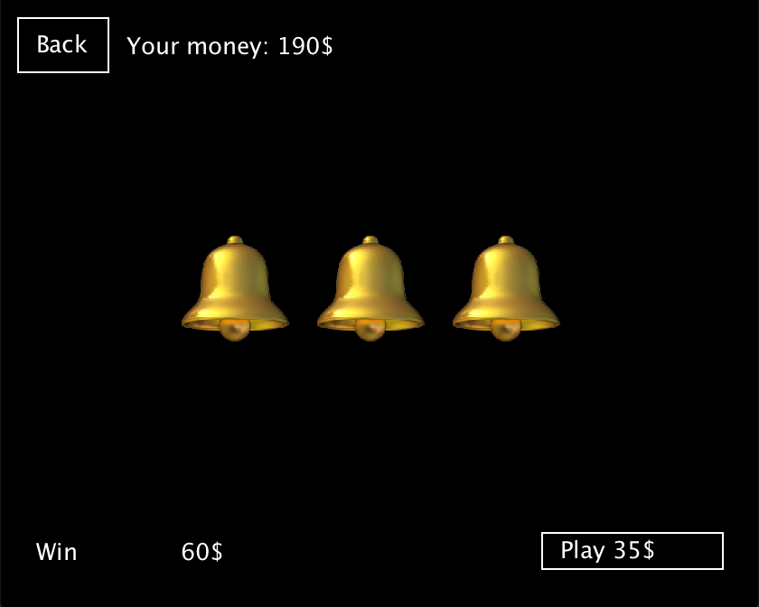
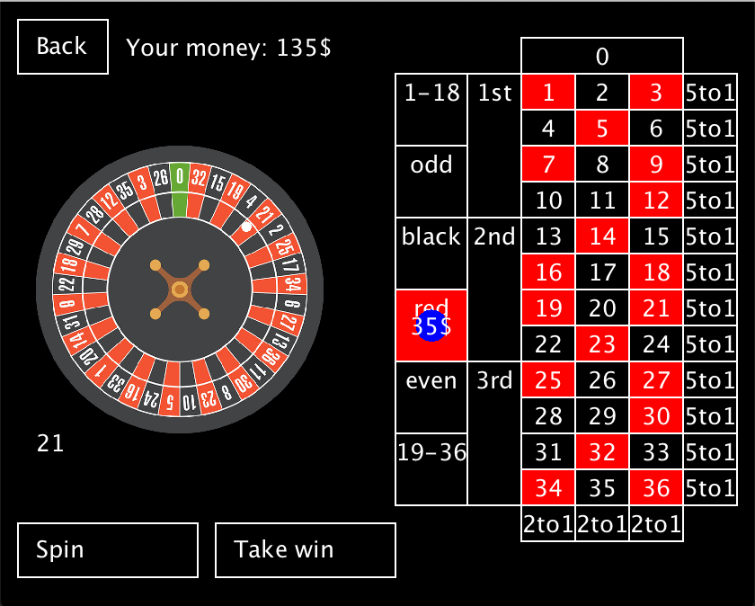

# Casino
My first Java project, created to pass the subject in the college

There is no architecture, no good practices, that's my first contact with this language.
Looking at this code may make you cry blood, and damage your eyesight. I don't take responsibility for that.

# How to run
```bash
git clone git@github.com:mtk3d/casino.git
mvn clean compile exec:java
```

# Games
## Jackpot

## Roulette
