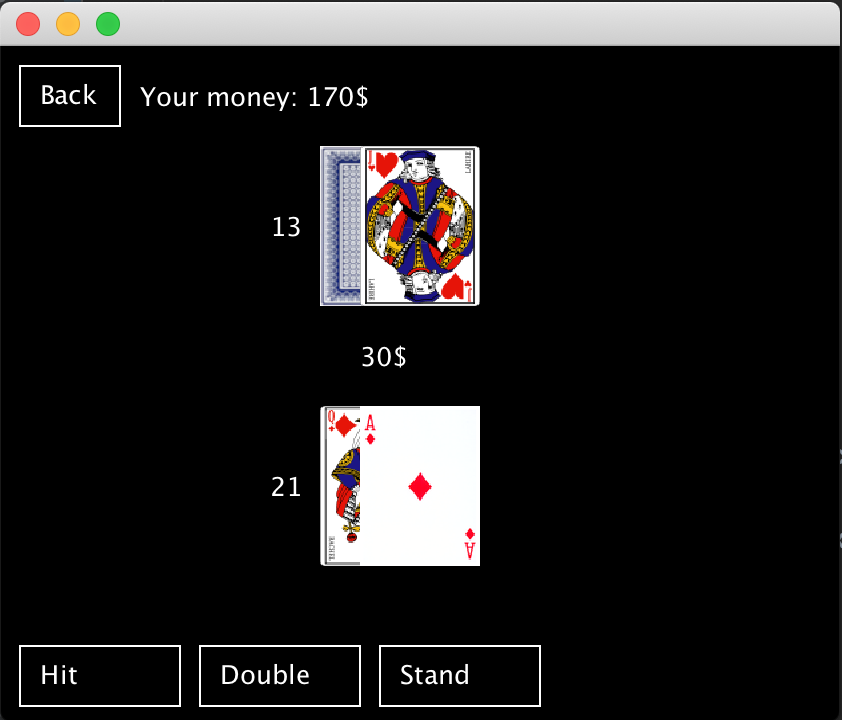

# Casino
My first Java project, created to pass the subject in the college

# How to run
```bash
git clone git@github.com:mtk3d/casino.git
mvn clean compile exec:java
```

# Games
## Jackpot

## Roulette

## Blackjack
